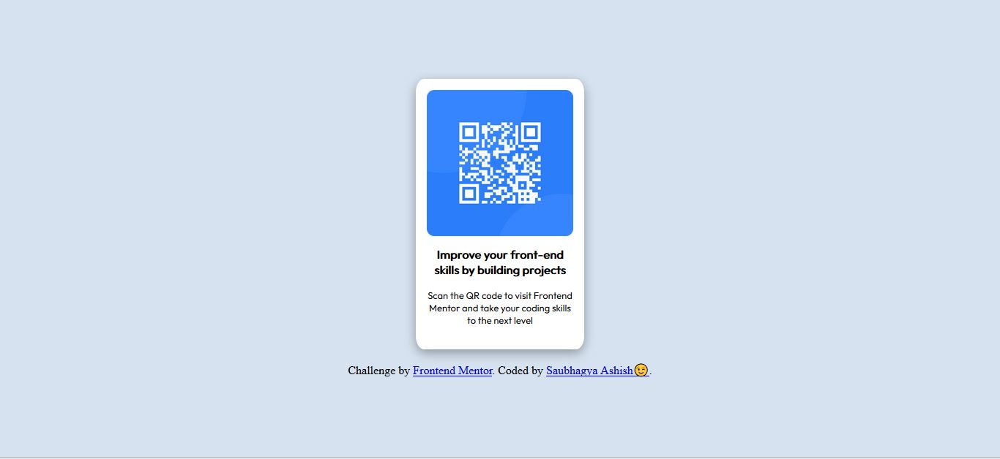

# Frontend Mentor - QR code component solution

This is a solution to the [QR code component challenge on Frontend Mentor](https://www.frontendmentor.io/challenges/qr-code-component-iux_sIO_H). Frontend Mentor challenges help you improve your coding skills by building realistic projects. 

## Table of contents

- [Overview](#overview)
- [Screenshot](#screenshot)
- [Built with](#built-with)
- [Author](#author)

## Overview
Here is my solution for QR Code challange by frontend mentor.
### Screenshot

### Links

- Solution URL: [Click for Solution](https://github.com/saubhagyaashish/qr-code-component-main/)
- Live Site URL: [Click to check it live](https://saubhagyaashish.github.io/qr-code-component-main/)

### Built with

- Semantic HTML5 markup
- CSS custom properties
- Flexbox

## Author

- Website - [Saubhagya Ashish](https://www.your-site.com)
- Frontend Mentor - [@Saubhagya Ashish](https://www.frontendmentor.io/profile/saubhagyaashish)
- Linkdin - [@Saubhagya Ashish](https://www.linkedin.com/in/saubhagya-ashish/)

